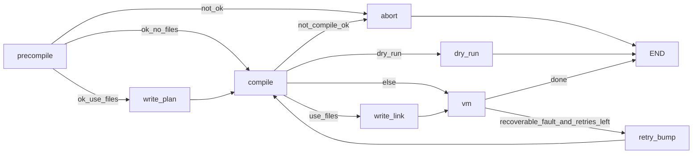
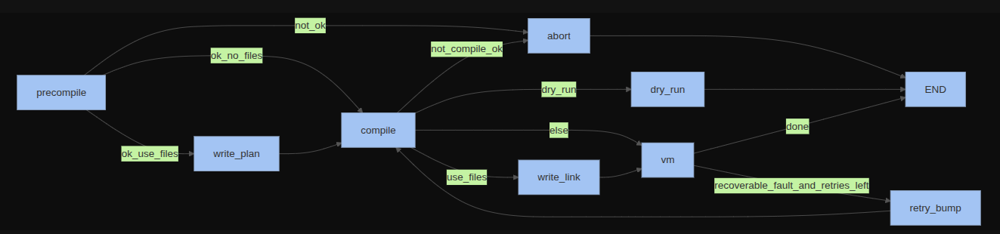

# Architecture

This document describes how the **pretend compiler** CLI is structured: orchestration (LangGraph), agents (LangChain chat models + structured output), the fictional intermediate representation (IR), and how local or hosted LLMs are selected.

## Purpose

The tool does not call a real compiler toolchain. Instead, it runs a **three-stage, LLM-driven pipeline** that (1) checks that source plausibly matches the declared language, (2) "lowers" it to a small JSON-like IR, and (3) **interprets** that IR in Python while optionally calling **sandboxed tools** for files, environment variables, and HTTP.

## Top-level layout

| Path | Role |
|------|------|
| [`pretend_compiler/cli.py`](../pretend_compiler/cli.py) | Typer entrypoints: `pretend-run`, `pretend-models`. Builds settings, chat model, initial state, invokes compiled graph. |
| [`pretend_compiler/settings.py`](../pretend_compiler/settings.py) | [`pydantic-settings`](https://docs.pydantic.dev/latest/concepts/pydantic_settings/) loading [`llm.env`](../llm.env.example). |
| [`pretend_compiler/llm_factory.py`](../pretend_compiler/llm_factory.py) | Constructs `ChatLlamaCpp` (GGUF), optional `ChatOllama`, or `ChatOpenAI` (`--hosted`). |
| [`pretend_compiler/models_registry.py`](../pretend_compiler/models_registry.py) | Pinned Hugging Face GGUF repos/files for `pretend-models pull`. |
| [`pretend_compiler/models_pull.py`](../pretend_compiler/models_pull.py) | Downloads GGUF via `huggingface_hub`, then upserts `MISTRAL_GGUF_PATH` / `QWEN_GGUF_PATH` in `./llm.env`; optional `ollama pull` helper. |
| [`pretend_compiler/state.py`](../pretend_compiler/state.py) | `PretendState` TypedDict carried through the graph. |
| [`pretend_compiler/graph.py`](../pretend_compiler/graph.py) | LangGraph `StateGraph`: nodes, conditional edges, retry. |
| [`pretend_compiler/agents/precompiler.py`](../pretend_compiler/agents/precompiler.py) | Language gate + plan (`run_precompile`). |
| [`pretend_compiler/agents/compiler.py`](../pretend_compiler/agents/compiler.py) | Compiler-shaped lowering (`run_compile`). |
| [`pretend_compiler/agents/heuristic_ir.py`](../pretend_compiler/agents/heuristic_ir.py) | Optional deterministic IR for trivial `for` + `printf`/`print` loops when the LLM returns empty ops. |
| [`pretend_compiler/agents/schemas.py`](../pretend_compiler/agents/schemas.py) | Pydantic models for structured LLM outputs. |
| [`pretend_compiler/agents/vm_runner.py`](../pretend_compiler/agents/vm_runner.py) | Sequential IR interpreter; aggregates stdout/stderr/exit/fault metadata. |
| [`pretend_compiler/agents/vm_tools.py`](../pretend_compiler/agents/vm_tools.py) | LangChain `StructuredTool` implementations + sandbox checks. |

## Orchestration (LangGraph)

The compiled pipeline is built by [`make_pipeline`](../pretend_compiler/graph.py) from a single chat model (`BaseChatModel`). State is a [`PretendState`](../pretend_compiler/state.py) dictionary: language, source, validation and compiler diagnostics, `ir_ops`, VM output, retry counters, sandbox flags, `dry_run`, and optional **`use_files`**.

With **`--use-files`**, after validation passes the graph runs **`write_plan`** first, saving the precompiler **`plan`** to **`{sandbox_dir}/pretend-linked.plan`**. After a successful compile it runs **`write_link`**, writing IR as JSON to **`{sandbox_dir}/pretend-linked.ll`** and clearing **`ir_ops`** from state; **`vm`** then reads the `.ll` file from disk.

- **precompile**: LLM structured output + deterministic checks (e.g. `ast.parse` for Python; brace balance for selected C-family languages).
- **compile**: LLM emits `ir_ops`; if `compile_ok` is false or IR is empty when success was claimed, the graph routes to **abort**.
- **dry_run**: Prints plan + JSON IR to `vm_stdout` without executing the VM.
- **vm**: Runs [`execute_ir`](../pretend_compiler/agents/vm_runner.py). On a **recoverable** IR `fault`, the graph can increment `retries` and run **compile** again (bounded by `max_retries` from the CLI).

## LLM backends

[`build_chat_model`](../pretend_compiler/llm_factory.py) chooses the implementation:

| Mode | When | Implementation |
|------|------|------------------|
| Hosted | `--hosted` | `ChatOpenAI` - `OPENAI_*` from settings (ignores `--backend`). |
| Ollama | `--backend ollama` | `ChatOllama` (requires optional `langchain-ollama` extra). |
| GGUF local | default `mistral` or `--backend qwen` | `ChatLlamaCpp` with [`resolve_gguf_path`](../pretend_compiler/llm_factory.py): explicit `MISTRAL_GGUF_PATH` / `QWEN_GGUF_PATH`, then project cache under `~/.cache/pretend_compiler/models`, then Hugging Face hub cache scan for the pinned filename.

GGUF artifacts are defined in [`models_registry.py`](../pretend_compiler/models_registry.py) and fetched with [`pretend-models pull`](../pretend_compiler/cli.py).

## Agents

### pretend-precompiler

- **Input**: `lang`, `source_text`, `source_path`.
- **Output schema**: [`PrecompilerOut`](../pretend_compiler/agents/schemas.py) - `validation_ok`, `diagnostics`, `plan`.
- **Deterministic augmentation**: merges Python `ast` and simple C-family brace checks with LLM diagnostics; final `validation_ok` requires both deterministic and model agreement where applicable.

### pretend-compiler

- **Input**: `plan`, `source_text`, `lang`; on VM retry, `vm_fault_hint` / `retries`.
- **Output schema**: [`CompilerOut`](../pretend_compiler/agents/schemas.py) - `compile_ok`, `diagnostics`, `ir_ops`.
- Prompts steer the model toward compiler-like concerns (diagnostics, unsupported constructs); the IR is still **interpreted locally** - it is not executed as arbitrary code.

### pretend-vm

- **Not** an LLM node. It is deterministic execution of `ir_ops` in [`vm_runner.py`](../pretend_compiler/agents/vm_runner.py).
- **`op: tool`** dispatches to [`make_vm_tools`](../pretend_compiler/agents/vm_tools.py) by tool name (filesystem: `read_file`, `write_file`, `read_bytes`, `write_bytes`, `list_dir`, `path_exists`, `remove_file`, `rename`, `mkdir`; env: `getenv`; network: `http_get`, `http_post`; stdin: `read_stdin`; wall clock / RNG: `sleep_ms`, `time_now`, `random_int`, `random_float`).
- **`print`**: after a `read_stdin` tool op, text may contain a **subset** of C `printf`-style conversions; the VM fills them from the last stdin line ([`vm_runner.py`](../pretend_compiler/agents/vm_runner.py)).

## Intermediate representation (IR)

`ir_ops` is a list of dictionaries. Supported `op` values (see [`vm_runner.py`](../pretend_compiler/agents/vm_runner.py)):

| `op` | Meaning |
|------|---------|
| `print` | Append `text` to pretend stdout (optional C-style `%` conversions after `read_stdin`; see VM runner). |
| `emit_stderr` | Append `text` to pretend stderr. |
| `exit` | Terminate with integer `code`. |
| `tool` | Invoke a named tool with `args`; optional `to_stdout` controls formatting. |
| `fault` | Stop with failure; optional `recoverable` and `hint` for graph retry. |

The compiler prompt in [`compiler.py`](../pretend_compiler/agents/compiler.py) documents these shapes for the LLM.

## Sandbox and safety

- **Filesystem**: Tools resolve paths under [`sandbox_dir`](../pretend_compiler/cli.py) (default current working directory). Escapes return a tool error string instead of touching the OS path. Binary I/O uses base64 with a size cap (see [`vm_tools.py`](../pretend_compiler/agents/vm_tools.py)).
- **Network**: `http_get` / `http_post` return an error unless [`--allow-network`](../pretend_compiler/cli.py) is set.
- **Process environment**: `getenv` reads the **real** process environment (documented behavior; not a second virtual env).
- **RNG**: `random_int` / `random_float` use a VM-local RNG; pass [`--vm-random-seed`](../pretend_compiler/cli.py) for reproducible runs.

## Configuration

- Copy [`llm.env.example`](../llm.env.example) to `llm.env` (gitignored). Keys are documented there; [`Settings`](../pretend_compiler/settings.py) loads them automatically.
- Optional: `N_CTX` (default 32768), `LLM_MAX_TOKENS` (default 8192; avoids truncating IR JSON), `N_GPU_LAYERS` for local llama.cpp (see [`llm_factory.py`](../pretend_compiler/llm_factory.py)).

## CLI surface

| Entry | Role |
|-------|------|
| `pretend-run` / `python -m pretend_compiler` | Run pipeline: `--lang`, source file, `--hosted`, `--backend`, `--sandbox-dir`, `--allow-network`, `--max-retries`, `--dry-run`. |
| `pretend-models pull mistral|qwen` | Download pinned GGUF into cache. |
| `pretend-models ollama [model]` | Shell out to `ollama pull`. |

Exit status follows `exit_code` from state (validation/compiler abort uses `1`).

## Testing

- Unit tests cover VM ops, sandbox escape handling, deterministic gates, and mocked graph paths (`../tests/`).
- Integration tests marked `@pytest.mark.local_llm` skip unless a Mistral GGUF is discoverable on disk.
- CI and constrained environments typically run `pytest -m "not local_llm and not hosted"` to avoid loading GGUF weights and to skip optional API smoke tests. The `@pytest.mark.hosted` tests call the hosted OpenAI-compatible API when `OPENAI_API_KEY` is configured (see `../.github/workflows/ci.yml`).

## Limits and non-goals

- Validation and "compilation" are **heuristic** (LLM + light static checks), not GCC/rustc.
- IR execution is **not** a sandboxed arbitrary-code evaluator: only the listed ops and tools run.
